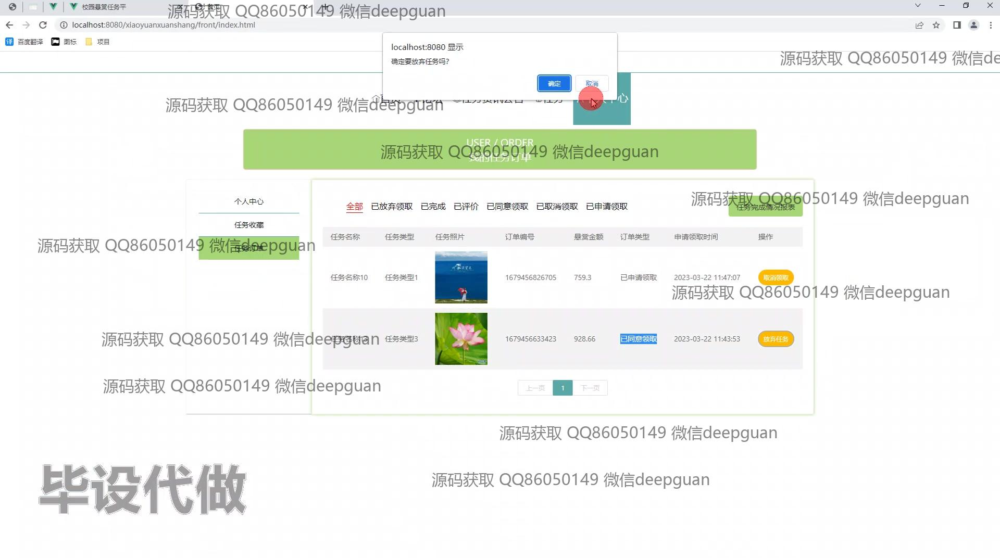

<h1 align="center">校园悬赏任务平台</h1>

## 简介
校园悬赏任务平台：角色分为管理员、用户；支持任务发布、管理和执行，任务资讯和论坛互动，用户个人信息管理与评价功能。系统界面简洁直观，优化了校园任务管理与交流体验。    --计算机毕业设计源码；毕设源码；java毕业设计源码

## 联系方式

<h3 align="center">获取完整代码与数据库文件 + 微信：deepguan QQ: 86050149 QQ群: 783742310</h3>

<h3 align="center">可帮忙远程部署 包运行成功！提供远程部署、修改代码、设计文档指导、代码讲解等服务！</h3>

## 功能介绍（完整见运行截图）
管理员： 基本功能：登录，注册，退出 管理界面：任务查看、添加、修改和删除，任务审核管理，任务评价管理，用户信息管理，论坛帖子管理 任务管理：管理并审核任务信息，提供任务状态和审核筛选功能 用户管理：调整用户权限，管理用户信息，支持余额充值与提现

用户： 基本功能：登录，注册，退出 网站首页：主导航栏，任务资讯公告，论坛界面，任务咨询与搜索 任务：发布、查看和管理任务，输入任务名称、编号、执行地点、奖金等详细信息，附带图片和附件上传 个人中心：查看修改基本信息，修改密码，查看任务订单和任务完成情况 其它功能：任务申请与咨询，查看任务评价与回复，以及论坛参与与管理

## 运行截图

本代码来源于网络,仅供学习参考使用!

